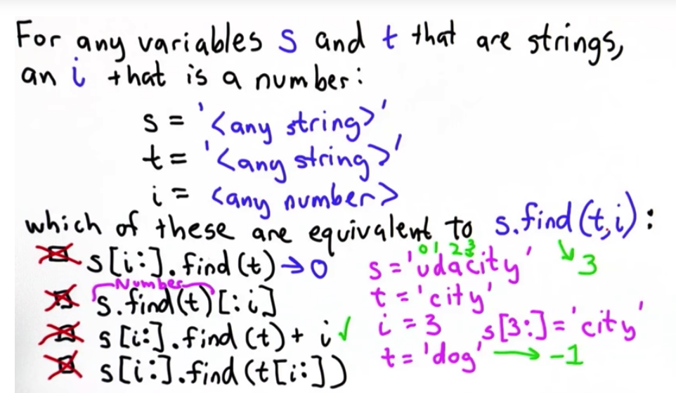
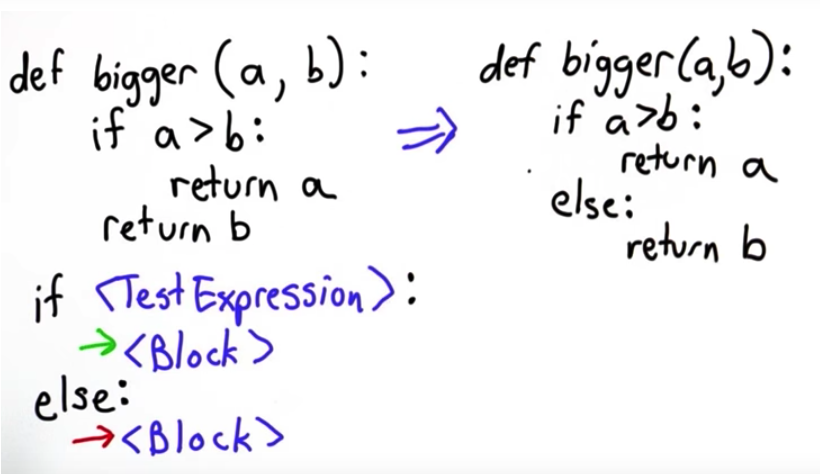
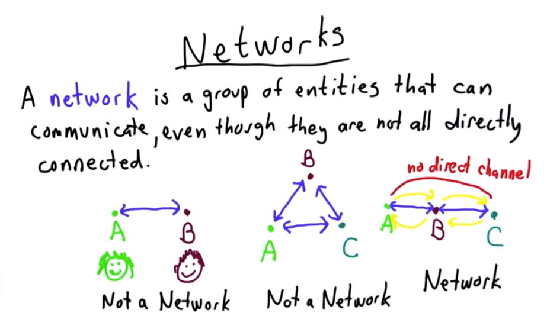
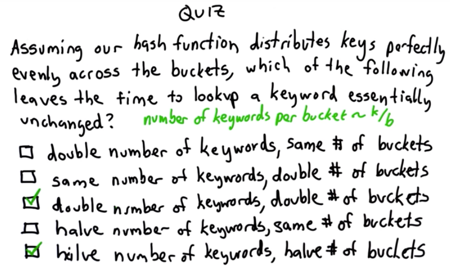
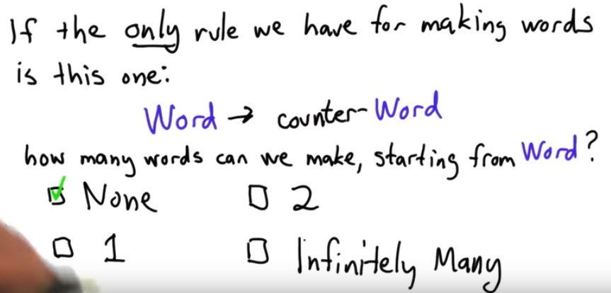
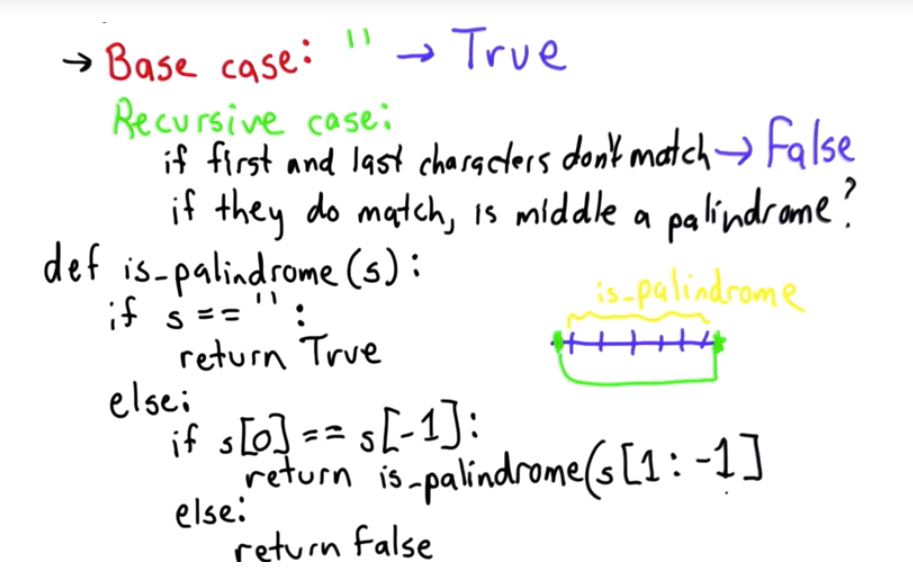

## Intro to Computer Science

-----------------

* John Backus(1924-2007), American computer scientist. Lead designer of Fortran programming language(1950s).

> FORTRAN was the world's first high-level programming language. It was developed at IBM by a small team led by John Backus. The earliest version of FORTRAN was released in 1957 as a programming tool for the IBM 704.
Fortran is a general-purpose, compiled imperative programming language that is especially suited to numeric computation and scientific computing. 
>> Fortran is rarely used today in industry — one ranking ranks it behind 29 other languages. However, Fortran is still a dominant language for the large scale simulation of physical systems,


* In computer science, __Backus–Naur form or Backus normal form (BNF)__ is a notation technique for context-free grammars, often used to describe the syntax of languages used in computing, such as computer programming languages, document formats, instruction sets and communication protocols. They are applied wherever exact descriptions of languages are needed: for instance, in official language specifications, in manuals, and in textbooks on programming language theory.


* Rule: Sentence -> Subject + Verb + Object

* Left side 的所有 Non-terminal 都必须按照 _Rule_ 替换成 terminal才终止。
> Blue, Non-terminal;  Pink, replacement.
>> Derivation,导出，引出； 

-----------------

* Python Expressions: the grammar must follow __Expression Operator Expression__ and an __Expression__


> Expression也可以是 ( )

-----------------

* Processor

	+ __GHz__, Abbreviation for __gigahertz__. _One GHz represents 1 billion cycles per second_. The speed of microprocessors, called the clock speed, often is measured in gigahertz. 

-----------------

* Grace Hopper (F) 

	+ Born in New York City in 1906, Grace Hopper joined the U.S. Navy during World War II and was assigned to program the Mark I computer. She continued to work in computing after the war, leading the team that created the _first computer language compiler_, which led to the popular __COBOL language__.
	
	> COBOL is a compiled English-like computer programming language designed for business use. It is imperative, procedural and, since 2002, object-oriented.
	
* Augusta Ada King (F)
	
	+ Who is arguably the world's first computer programmer. 1815-1852, England
		
	+ Countess of Lovelace was an English mathematician and writer, chiefly known for her work on Charles Babbage's proposed mechanical general-purpose computer, the Analytical Engine.

-----------------

* Variables
	+ _Name_ = _Expression_

-----------------

* String -- Sequence of characters

	+ 表达:
		- Python 的 String 必须、可以用单引号'' 和 双引号“”, 只要前后一致即可, 中间可以另有引号！ _(Java中单引号是指 char)_
		
	+ 串联：
		- String与String可以简单的用“+”串联起来！但是Can't concatenate _"str"_ and _"int"_ objects. String不能通过+、-与数字相连，不可以将 string +/- , 但可以使用“*” multiple. (eg. '!' * 3 --> !!!)
		
	+ Index[]
		- 可以通过 Index--[] 定位 String 的字符。 __Index可以是负数，但不能大于length-1__. 如果 index > length - 1, 会出错 _“out of range”_ ! 但index可以是 _负数_! 负数则是从最末尾计数。(eg. S = "Dave", S[-1] = 'e')

	+ Selecting Sub-Sequences
		- <String>[Number] --> One character String. (eg, Name[0])
		
		- <String>[Number1 __:__ Number2] --> __[Number1, Number2)__. A subsequence of the characters in S starting from position _Number1_, and ending with position _Number2 - 1_. 
		
		> eg. word = "assume", word[3:4] --> u; word[4:6] --> me; word[4:] --> me; word[:2] --> as; word[:] --> assume. 
		
		
		> A. S[:], 始终是S本身;
		
		> B. S[0:0] 是 empty string； s + empty string = s.
		
		> C. __若s=‘’, 为空，那么s[0]--> error; s[12:12] --> ‘’，为空。__
		
		> D. S[:-1], 因为-1代表string最后一个符号, 因此如果S非空，该选项永远无法得到最后一个char. ( eg. s='udacity', s[:-1] --> 'udacit' )
		
		> E. 如果string少于3个characters, 那么S[3:]成为 Empty.
		
		
		>>> Puzzle: C, E. s如果少于4个字符，那么s[:3]和 s[3:] 为什么不会出错？？？
		
		
	+ Finding Strings in Strings:
		- < targetString>.find(< targetString>), if __Not found, return -1__; else, return __number__ that gives first posistion in _searchString_ where the _targetString appears_. (eg. "test".find('t') / 'test'.find("t") )
		
		
		> B. targetString变成了 character, 's'.
		
		> D. s.find(""), 如果targetString为空，则永远return 0.
		
		> E. find函数返回值始终为 -1， -1 + 1 = 0.

		
	+ Finding with Numbers:
		- < targetString>.find(< targetString>, Number), if __Not found, return -1__; else, return __number__ that gives first posistion in searchString where the targetString appears __at or after Number__. 
		
		
		> Quiz
		
		> C. 仅当t找不到，return -1 时 C 不正确！
		

-----------------

* Extracting Links

	
	
	+ start_link: 
	
		
	
	+ url:
		
		
	> page[A : B], 中间是 __冒号:__ 
	
	
-----------------

* Quiz:
	
	
	> D. 相当于两次的 Swap, 最后数值没有变化。
	>> The syntax __a, x = x, a__ is an assignment statement where __all the values on the right side are assigned to the corresponding variables on the left side.__ For example, after a, b = 3, 4 the value of a is 3 and the value of b is 4.


	
	
	> B. 当 S 为empty, S[0]--> error, 因为 S 的 index=0 处没有character.
	
	> D. __Subsequence Operator [:] 不会产生错误！__ 因此，当S 为 empty, S[0:]也不会有错误！！！


-----------------

#### Procedure

+ def name():
	- function 用 "def" 开头，并且使用":", 每一行结束不需要";"
	- 没有type前缀！
	

+ Quiz:
	
		
	> A B选项都正确！ 但是C 错误！因为a的值并没有被改变，最后返回的是一个新的整数、该整数是a,b的和， 这个整数与a无关！
	
-----------------

* If
	

	+ if 后面的条件直接写，不需要括号" _( )_ "
	+ __if< TextExpression>__ 和 __else__ 的后面都要接 __冒号“:”__
	+ return boolean时候， __"True" 和 "False" 首字母要 大写__
	
			
	
	> if 可以一直单独分类，也可以使用 if-else 类型。

-----------------

* Or
	+ If the first expression evaluates to True, the value is True and the second expression is not evaluated
	+ If the first expression evaluates to false, the value is the value of the second expression
	+ `< expression1> or < expression2>`
	
	> 在 Or 逻辑里，__< Expression1> or < Expression2>__ 第一判断expression1， 若正确则不许判断 expression2 直接得到结论正确；若错误则继续判断 expression2，正确则为 True, 反之为 False.

	
	>> 虽然 `this_is_an_error` 是个error, 但是当 or 前面是True, 按照规则则结果为True; 但若 or 前面是 False, 则结果将是 Error 而不是 False！
	
-----------------

* And 
	+ `< expression1> and < expression2>`
	
-----------------


* Alan Turing (1912-1954)

	+ Alan Turing is often called the father of modern computing. He was a brilliant mathematician and logician. He developed the idea of the modern computer and artificial intelligence. During the Second World War he worked for the government breaking the enemies codes and Churchill said he shortened the war by two years.
	
	+ Developed abstract model of a computer(1936) -- "Turing Machine". Proved that a machine with a few operations could simulate any other machine!

> __Turing machine__ is a hypothetical machine thought of by the mathematician Alan Turing in 1936. Despite its simplicity, the machine can simulate ANY computer algorithm, no matter how complicated it is! Above is a very simple representation of a Turing machine.
 	
	
-----------------

* While
	
	
	+ while 命令行末尾需要 "冒号:"

		> 
		
	+ Quiz:
		- Factorial:
		
		
		> result 初始值为1，方便后续的阶乘; 需要着重判断 f(0) == 1 的情况！
	
-----------------

* Break
	
	+ break 发生时， __jump out the loop!__
	
	>
	>> 左右code的功能完全一样，但是右边 break 类型更加复杂、易出错，通常应该避免这种写法。
	
	+ Quiz:
		1. 
		
		> 逻辑： < T >正确 --> < S > 一直循环！
		>> A. if False: 用于错误， 不会执行 break
		
		>> B. break 承接在 < S> 后面执行
		
		>> C. 逻辑相反。
		
		>> D. 满足逻辑。< T> < S> 写在 while block 还是 if block 中不会有影响。		
		
	
		2. 
		
		> return 的 "None，0" 不能带引号__" "__
		
		
		
		>> 为了保证 while block 一直进行下去，则while 条件应该永远正确 -- True； if-else 中 的else 需要跳出循环，因此为 break.
	
	
		3. 
		
		> 逻辑： test(a), 正确 --> b; 错误 --> a.
		>> proc2. test(b)完全与逻辑无关
		
		>> proc4. 满足逻辑。 b = 'udacity' 在 test(a) 错误里，此时return a 即可，修改 b 不影响逻辑！
		
		
		4. 
		
		> "Blastoff!" 需要写在 __引号" "__里面，表示string. 之前的"None, 0"并不需要，因为 None 系统识别，0为数字！
		>> __if 和 while__ 后面的条件， _可以直接写，也可以写在括号()里!_
	
	
-----------------

* Understanding a Computational Problem:
	+ Know what the possible __input__ and __output__ are!
	+ Work out example! Understand the relationship! (编制实例， 帮助理解问题、解决问题)
	+ Coding! including "Pseudocode"!
	
		> Simple Mechanical Algorithm
		> 
		
	+ Don't optimize prematurely! (不要过早的优化！)
	
		> 
	
		>> eg.  
	
	+  Refine later!
		> 
		
	> 	
	>> __assert < Expression>__ 也可以写成 __assert not < Expression>__. assert前面使用 _not_ 会使逻辑相反！
	
	> 	
	>> To give an assertion failure when the inputs are invalid! 有两种方式 
	>>> 1. __assert not__ dataIsBefore _(year2, month2, day2, year1, month1, day1)_
	>>> 2. __assert__ dataIsBefore _(year1, month1, day1, year2, month2, day2)_ 也是可行的。


	+ Solution: 
		- `isLeapYear (year)`
		- `daysInMonth (year, month)`
		- `nextDay (year, month, day)`
		- `dateIsBefore (year1, month1, day1, year2, month2, day2)`
		- `daysBetweenDates (year1, month1, day1, year2, month2, day2)`
	
	> _isLeapYear()_ : 
	
		
		
		

	> 使用 test() 进行测试， __assert < Expression>__
	>> 		

-----------------

#### How to Manage Data

* String vs. List
	
	> String 中sub-string, 得到 __子string( " " )__; List 通过[a:b]得到的也是 __子数集( [ ] )__


* Nested List
	+ mixed_up, eg. [ 'apple', 3, 'orange', 27, [ 1, 2, [ 'alpha', 'beta']] ] 


* Mutation:
	+ __String 是不可以改变的 immutable!__ 不论是重新赋值(s = a, s = b)，还是增加字符(s = s + 'w'), __都会重新生成一个新的String, 并改变 reference ！__
	> eg. s = 'Hello', s[0] = 'Y' ----> Error! 'str' object does not support item assignment
	
	+ __List 允许直接修改其成分 mutable, 而不会重新生成新的object!__ 
	> eg. P = ['h', 'i' ]. P[0] = 'H', P = [ 'H', 'i' ]

	
* List Operations
	+ __append()__:  < List> append(< element>)
		> __在List的末尾添加元素__
		>> ls = ['Moe', 'Larry'],  _ls.append('Curly')_ --> ls = ['Moe', 'Larry', 'Curly'];  [1,2].append([3,4] --> [1, 2, [3, 4] ]
		
	+ __+__: < List 1> + < List 2>
		> __在List1 末尾加入 List2__
		> [1,2] _+_ [3, 4] --> [1,2,3,4]
		
	+ __len()__:
		> len([0,1]) --> 2; len(['a', ['b',['c']] ]) --> 2; len(‘udacity') --> 7
		
		
-----------------

* DRAM
	


* Memory Hierarchy
	
> ms微妙 10^(-3); ns纳秒 10^(-9); nm纳米 10^(-9); 
>> nano  10^(-9)
>> million  10^6;  billion  10^9; trillion  10^12;
	
	```Python
	speed_of_light_mps = 299792458
	
	lat_cpureg = 0.0000000004
	lat_dram = 0.000000012
	lat_hdd = 0.007
	
	print speed_of_light_mps * lat_cpureg	# 0.1199169832
	print speed_of_light_mps * lat_dram		# 3.597509496
	print (100. / 8800000000000) * 10 ** 9	# 0.0113636363636
	print speed_of_light_mps * lat_hdd / 1000	# 2098.547206
	```

-----------------

* Loops 

	+ __While( )__
	
	> __while( )__ "i < len(p) " ==  "i <= len(p) -1 "
	>> 找出最后一个index 可能的的数值(eg.len(p) -1)，i可以取值到这个数则使用 __"="__
	
	+ __For__: `for 'name' in <list> `:

```Python
def sum_list(a):
	sum = 0	#sum必须在使用前initiatlized并且赋值
	for n in a:
		sum = sum + e
	return sum
	
```
>>> sum必须在使用前( sum = sum + n) initiatlized 并且赋值

-----------------

* Index: 寻找出 target 在 List 中第一次出现的 index	
	
	> < V> not in < L> _exactly equivalent to_ not < V> in < L> 
	
	+ __index()__: return _firstIndex or Error_
	+ __in__: return _True or False_
	+ __not in__: return _True or False_
	>> Python中， A not in B 和 not A in B 都可以！

* Quiz:
	
> p.index(target) 返回值为 __有效的index__ 和 __Error__, 故此不可以直接运用！(题目要求 "未找到则返回 -1")！ 需要结合 __in / not in__

------------------

* Pop
	
	
> pop() 是最后remove __last 最后__ 一个元素！
>> append() 是 __在 List 末尾__ 添加元素
	
+ Quiz:
	
	> __Depth-First Search__
	
	>> `while tocrawl`中，tocrawl 是一个list, 但是这里可以用来表示 __"tocrawl不为空"__ ， 类似一个boolean


+ Quiz:
	
	
+ Quiz:
	
	

+ Quiz:

```Python
A valid sudoku square satisfies these two properties:

# 1. Each column of the square contains each of the whole numbers from 1 to n exactly once.

# 2. Each row of the square contains each of the whole numbers from 1 to n exactly once.

# You may assume the the input is square and contains at least one row and column.
```


>>> 

* __Python 的书写 intent 的要求严格, IndentationError...__

------------------

* Responding to Queries

+ Quiz
	

+ __< String>.split()__ 
> eg. 
>> __标点跟随最近的字符, 'dog.'__

+ Quiz
 
```Python
def add_to_index(index,keyword,url):
    for entry in index:
        if entry[0] == keyword:
            entry[1].append(url)
            return
    index.append([keyword,[url]])
    
def lookup(index, keyword):
    for entry in index:
        if entry[0] == keyword:
            return entry[1]
    return []
    
def add_page_to_index(index,url,content):
    words = content.split()
    for e in words:
        add_to_index(index, e, url)
```


+ Quiz: add page to index 
	

------------------

* The Internet


```Python
def get_page(url):
	try:
		import urllib
		return urllib.urlopen(url).read()
	except:
		return ""
```

------------------

* Networks



* To way to measure Networks

	+ Latency: time it takes messages to get from source to destination (_millisecond_  1000 milliseconds = 1 second )
	
	
	> A.B.D -- Latency
	>> C. -- Bandwidth
	
	+ Bandwidth: amount of information that can be transmitted per unit time (_bits per second, Mbps (million bits per second)_ )


* What is a bit？
	+ __Bit 比特: 二进位制信息单位__
	+ 1 bit = smallest unit of information

	+ 
	> is star in either G or P? 
	

* Making a Network
	
	
	
* Protocols
	

* Quiz:
	+ Better Splitting
		
		> 使用 output[-1] 定位到 output list最后一个元素！
		>> List中使用"__append 和 +__" 的区别！ append是在 List末尾添加元素； + 是在 List 中某元素内添加字符
		
	
------------------

* How Programs Run Making things fast

* Stopwatch
	
	> time_execution(code) 和 __eval__(code)中的code, 可以是 Python 的任意expression, （普通计算式甚至method都行）
	
	

* Make Big Index
	
	
	
	
	
* Lookup Time
	
	>> lookup()中， 'aaaaaaaa'在第一个位置， 几乎0s就可以得到结果。

```Python
def make_big_index(size):
    index = []
    letters = ['a', 'a', 'a', 'a', 'a', 'a', 'a', 'a']
    while len(index) < size:
        word = make_string(letters)
        add_to_index(index, word, 'fake')
        for i in range(len(letters) - 1, 0, -1): 
            if letters[i] < 'z':
                  letters[i] = chr(ord(letters[i]) + 1)
                  break
            else:
                   letters[i] = 'a'
    return index
```

* Worst Case
	
	> number of times through the loop depends on len(index)
	
* __Is our lookup fast enough__?
	+ _It depends on how many keywords there are and how many look ups there are_

	+ Why it's so slow?
		- There is a for loop: 每次都需要从头开始 循环loop

* Making Lookup Faster

	
>> 不需要从头Loop, 可以直接定位首字母为 'u', 针对性的开始查找！


* Hash Table
	
	> k > b, 因此 大约每个 bucket 中都有 __k/b__ 个keywords！
	
	
* Hash Function
> 

>> __ord(< one-letter string> ) --> Number__ 
>>> 必须是 single letter! 

>> __chr(< Number> ) --> < one-letter string>__
>>> _chr( ord(s) ) --> s_ 当s为one-letter
>>>  
>>> _ord( chr(s) ) --> s_ 当s为number


* Defining a Hash Function

	


* Quiz
	+ Bad Hash
		
		
		> 
		> 
		>> __作为一个好的 Hash, 每个bucket中的元素应该大致相同！__
		
	+ Better Hash Functions	
		
		
	+ Keywords and Buckets
		

	+ Implementing Hash Tables
		
	
	```Python
	# Creating an Empty Hash Table. Define a procedure, make_hashtable, that takes as input a number, nbuckets, and returns an empty hash table with nbuckets empty buckets.
	
	def make_hashtable(nbuckets):
		i = 0
		table = []
		while i < nbuckets:
			table.append([])
			i = i + 1
		return table
	```
	
* __range( start, stop ):  -->  [start, stop-1]__
	> eg. for e in range(0, nbuckets):

```Python
def make_hashtable(nbuckets):
	table = []
	for unused in range(0, nbuckets):
		table.append([])
	return table
```
	
* Quiz
	+ The hard way
		
		> Why does __[ [] ] * nbuckets__ not work to produce our empty hash table？
		>> Because __each element in the output refers to the same empty list__.
		>>> 
	
	
	+ Finding Buckets
		
		
```Python
def hashtable_get_bucket(htable,keyword):
	return htable[hash_string(keyword, len(htable))]

def hash_string(keyword,buckets):
    out = 0
    for s in keyword:
        out = (out + ord(s)) % buckets
    return out

def make_hashtable(nbuckets):
    table = []
    for unused in range(0,nbuckets):
        table.append([])
    return table
```
	
* Adding Keywords	

```Python
def hashtable_add(htable, key, value):
	hashtable_get_bucket(htable, key).append([key, value])
```

* Lookup

```Python
def hashtable_lookup(htable,key):
    bucket = hashtable_get_bucket(htable, key)
    for e in bucket:
        if e[0] == key:
            return e[1]
    return None
```
> 当存在多个key的时候，Lookup()永远会先返回第一个目标


* Update

```Python
def hashtable_update(htable,key,value):
    bucket = hashtable_get_bucket(htable,key)
    for entry in bucket:
        if entry[0] == key:
            entry[1] = value
            return htable
    hashtable_add(htable, key, value)
    return htable
```
------------------

* Dictionary
	

	+ Quiz: Population
		
		
	> 不需要写在 def 里面，可直接定义 Dictionary = {}
>> Key : Value, value可以为任意类型（数字，字符，甚至dictionary）

	> 
	>> __KeyError, 指目标不包含__ ， 可以通过 __Key in elements__ 返回 True/False 进行判断！！

------------------

* Modify the Search Engine
	
	> addPageToIndex 不需要改写的原因是因为 -- 内部运用了 AddToIndex()

	

	+ Replace:
		- craw_web()
				
		> 只需要将 index 变为 __{}__
		
		- addToIndex()
		
		> 不需要 Loop整个index进行查找，使用 __keyword in index__ 即可判断!

		- lookup()
		
		> 不需要 Loop 整个index
		
>>> __for < key> in < dictionary>: 可以直接作判断__ 

------------------

* Quiz
	+ When Offered
		
		
		```Python
         for < key> in < dictionary>:
            < block>
		```

	+ Involved
		
		> output[hexamester].append(course) 是直接添加课程；
		>> output[hexamester] = [course]是重新在 output中加入新的配对！
		
		
	+ Shift n Letters
		
		
		> Shift a letter:
		> 
		
		```Python
		def shift(letter):   
			alphabet = ['a','b','c','d','e','f','g','h','i','j',
			'k','l','m','n','o','p','q','r','s','t','u','v','w',
			'x','y','z']
    		return alphabet[(alphabet.index(letter) + 1) % 26]  
		```
	
------------------

* How to have Infinite Power
	
	+ Quiz: Counter
		
		
		> Word --> counter-Word 是circular definition, 永远不会停止，因为只要存在 'word', 就必须被替代成 'counter-word'.

------------------

* __Recursive Definitions (2 parts)__
	+ __Base case__ - a starting point
		- Not defined in terms of itself
		- Smallest input -- already know the answer
		
	+ __Recursive case__ 
		- Defined in terms of "smallest" version of itself


	+ Quiz
		
		
		> A. No base case, can't stop

------------------

* Recursive Procedures
	
	
	+ Quiz: Recursive Factorial
	
	```Python
	def factorial(n):
   		if n == 0:
    		return 1
    	return n * factorial(n - 1)
	```

------------------

* Palindromes 回文
	
	
	```Python
	def iter_palindrome(s):
		for i in range(0, len(s) /2):
			if s[i] != s[-(i + 1)]:
				return False
		return True
	```
	> 当回文特别长的时候，第二种方式会更加高效 more efficient!
	>> 因为 1. Recursive definition 每次都要不断生成新的String； 2. Recursive definition call themselves are fairly expensive in Python!尽管有些语言recursion可以高效，但是python并不是。
	>>> 对于大部分语言，优先使用 recursive way可以提高效率！

------------------

* Fibonacci
	
	```Python
	def fibonacci(n):
	    if n == 0 :
	        return 0
	    if n == 1 :
	        return 1
	    return fibonacci(n-1) + fibonacci(n-2)
	```
	
* Quiz
	+ Counting Calls
		
	
	+ Faster Finonacci
		

	+ Popularity
		

------------------

* Altavista
	+ The most popular web-search engine in 1998 (Yahoo). Now it's dead because it's hard to compete with Google!

------------------

* Quiz
	+ Implementing Urank
		
		
		> Graph 为一个 Dictionary, url, 以及link to this url的 url.
		
------------------

* Formal Caculations
	

* Computer Ranks

```Python
def compute_ranks(graph):
	d = 0.8	#damping factor
	numloops = 10
	
	ranks = {}
	npages = len(graph)
	for page in graph:
		ranks[page] = 1.0 / npages
	
	for i in range(0, numloops):
		newranks = {}
		for page in graph:
			newrank = (1 - d) / npages
			for node in graph:
				if page in graph[node]:
					newrank = newrank + d * (ranks[nodes] / len(graph[node]))
			newranks[page] = newrank
		ranks = newranks
	return ranks
```


------------------

* Python 1, 2, 3之间变化不大，应用上没有太大的改变。（eg. Python3不能直接使用print）


------------------

* Theme
	+ Abstraction
	+ Universality
	+ Recursive definitions
	
	

------------------

* Quiz
+ Triangular Numbers
	
	```Python
	1
	1 + 2 = 3
	1 + 2 + 3 = 6
	1 + 2 + 3 + 4 = 10
	1 + 2 + 3 + 4 + 5 = 15
	Write a procedure, triangular, that takes as its input a positive 
	integer n and returns the nth triangular number.
	
	def triangular(n):
		i, r = 1, 1
		while i < n:
	    	i = i + 1
	    	r = r + i
		return r
		
	def triangular2(n):	
		number = 0
		for i in range(1, n+1)
			number = number + i	
		return number
	```
	
+ 


------------------


* Waiting
	- Lessen 7 -- 2 Quiz: Stamp
	- Lesson 8, Problem Set（Optional 2) -- 1,2,3, 5
	
	- lesson 13 --  2, 3
	- lesson 14 -- 1,2, 3, 4
	- Lesson 16 -- 6
	- lesson 17 -- 4
	- Lesson 19 -- 1, 6, 7
	- Lesson 20 -- 3
	- Lesson 23 -- 3, 4, 5
	- Lesson 24 -- 1,2,3
	- Lesson 27 -- 4, 5, 6, 7, 8, 9
	- Lesson 28
	- Lesson 29
	
	
-------
